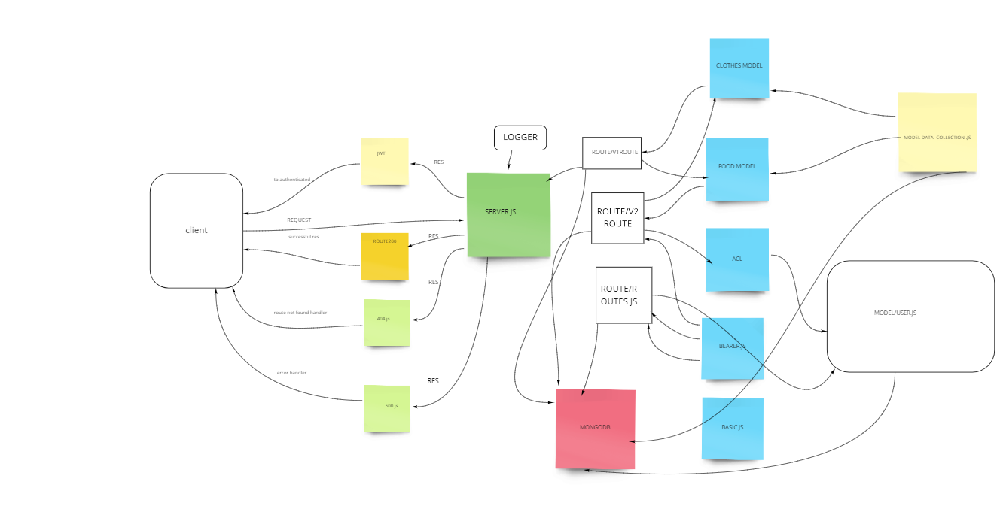

# auth-api

## LAB -08 Role Access Control

- <a href=https://auth-server1.herokuapp.com/ class="">go to heroku app </a>

- <a href=https://github.com/nassir1976/auth-api.git class="">go to gitHub </a>

- <a href=,,,,,,class=""> pull request </a> 

## Over-view 

- In this lab, we implement Role Based Access Control (RBAC) using an Access Control List (ACL), allowing to not only restrict access to routes for valid users, but also based on the individual permissions we give each user.

### Requirements
- In this final phase, the new requirement is to extend the restrictive capabilities of our routes to our API, implementing a fully functional, authenticated and authorized API Server using the latest coding techniques

Specifically, we want to make the following restrictions:

- Regular *users* can *READ*
- Writers can READ and CREATE
- Editors can READ, CREATE, and UPDATE
- Administrators can READ, CREATE, UPDATE, and DELETE

### Task 1: Combine these 2 servers into a single server
##### Your server should respond to the following routes:
- POST /signup to create a user
- POST /signin to login a user and receive a token
- GET /secret should require a valid bearer token
- GET /users should require a valid token and “delete” permissions

### Task 2: Create a new set of “Protected” API routes

V2 API Routes (/api/v2/...) must now be protected with the proper permissions based on user capability, using Bearer Authentication and an ACL
- app.get(...) should require authentication only, no specific roles
- app.post(...) should require both a bearer token and the create capability
- app.put(...) should require both a bearer token and the update capability
- app.patch(...) should require both a bearer token and the update capability
- app.delete(...) should require both a bearer token and the delete capability

### Documentation
- Compose a UML or Process/Data Flow Diagram for every application

